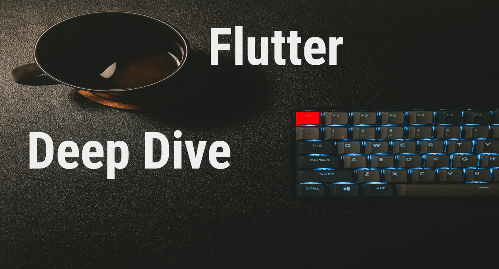

# Flutter Deep Dive

The app demo code, articles, and the book series. Features:

-Skeleton-apps by state-management solution

-UI app examples

-Full demo apps

-Advance techniques in OOP, FP, RX, design, etc

-Advance shown techniques in dev-ops

## Table of Contents

## App Skeletons

It's easier to start learning flutter if the app skeleton you start using is already set-up to give the maximum unit test feedback. Skeleton-apps by state solution:

-[Command, the easy state management system for new developers to start with]

-[Cubit, the easy way to use provider]

-[RiverPod, a more improved way to use provider]

-[Mobx]

-[GetX, an advance way to use getit for state management]

-[Modular, a non-stateful-widget way to manage state]

-[Flux, using info flow to manage state]

-[Redux, Flux with a real state container]

## OOP Exploration

## UI Exploration

## Dev-OPS Demos

## Deep Dive Series Book

## License

BSD 2nd-clause license

## Acknowledgements

Thanks to Mathew Carrol for being such a great example of training flutter developers.

## Trademark Notice

Google LLC owns the following trademarks; Dart, Flutter, Android, Roboto, Noto. Apple Inc owns the trademarks iOS, MacOSX, Swift, and Objective-C. Apple Inc owns the trademarks to their fonts of SF Pro, Sf Compact, SF mono, and New York. JetBeans Inc owns the trademarks to JetBeans, IntelliJ, and Kotlin. Oracle Inc owns the Java trademark. Microsoft Inc owns the trademarks of MS Windows OS and Powershell. Gradle is a trademark of Gradle Inc. The Git Project owns the trademark to Git. Linux Foundation owns the trademark of Linux. Smartphone OEM's trademarks to their mobile phone product names. To the best of my ability, I follow the brand and usage guidelines with the above-mentioned trademarks.

## About Fred Grott

I'm the crazy one that is starting to teach Flutter App development during the COVID-pandemic. The first Flutter App development book in my Flutter-Deep-Dive series is being published in the fall of 2021. My Flutter Development articles are at:

[My medium blog](https://fredgrott.medium.com
)

Personal Keybase site is:

-[My Keybase Site](https://fredgrott.keybase.pub)

And, I can be DM'ed on Keybase at:

-[My Keybase Profile](https://keybase.io/fredgrott)

## Code of Conduct

You cannot joke about something you are not as you will always goof-up on what might be funny for that person so, only joke about yourself instead. If you cannot treat them as you would treat your children, your brothers and sisters, and your parents it may be the wrong action to do towards another person.
